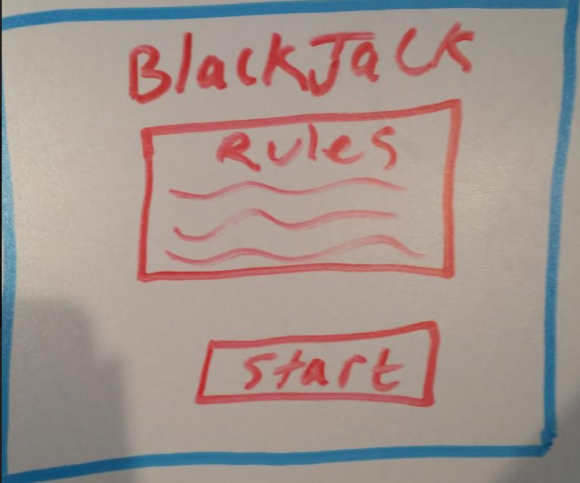
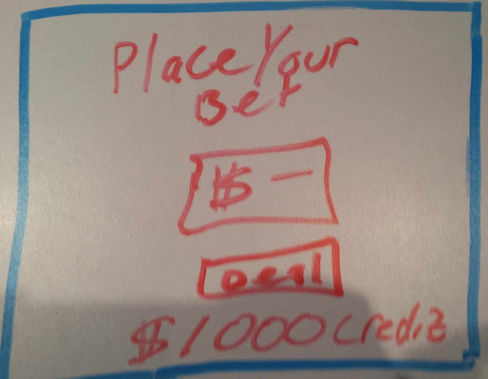
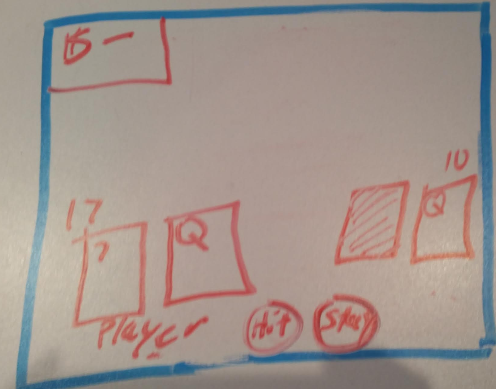
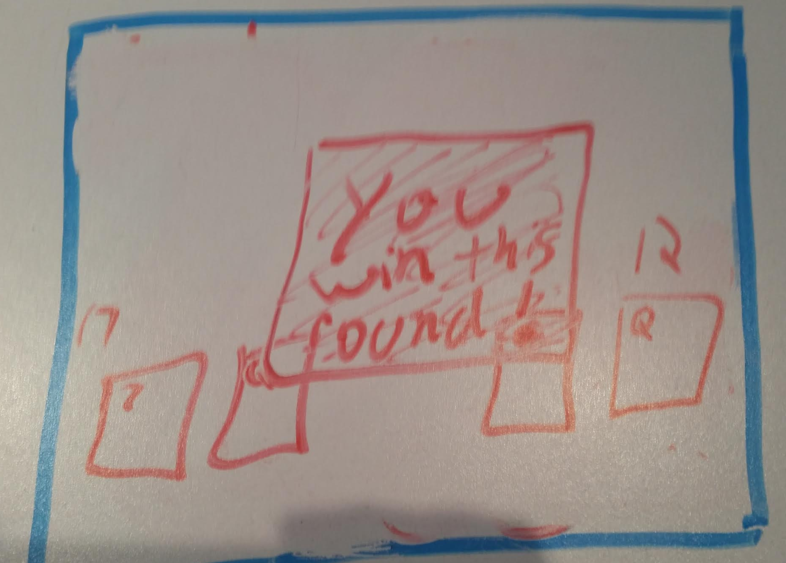
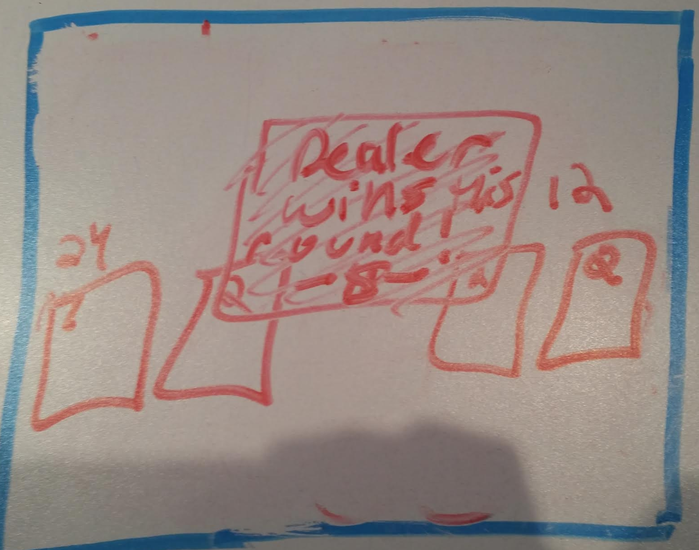
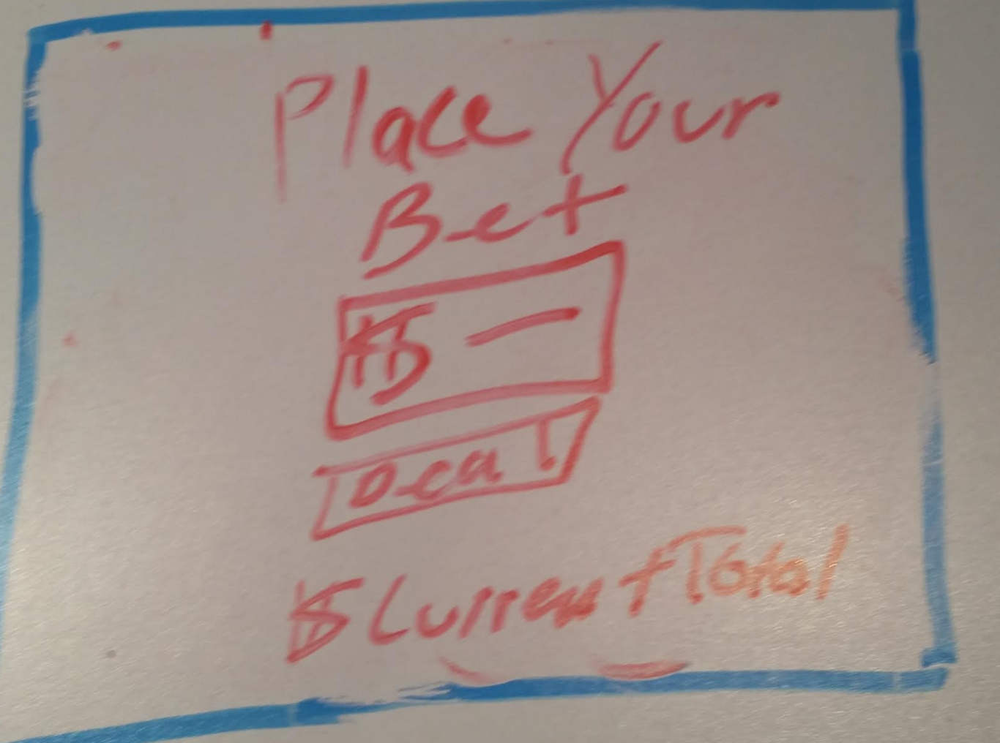
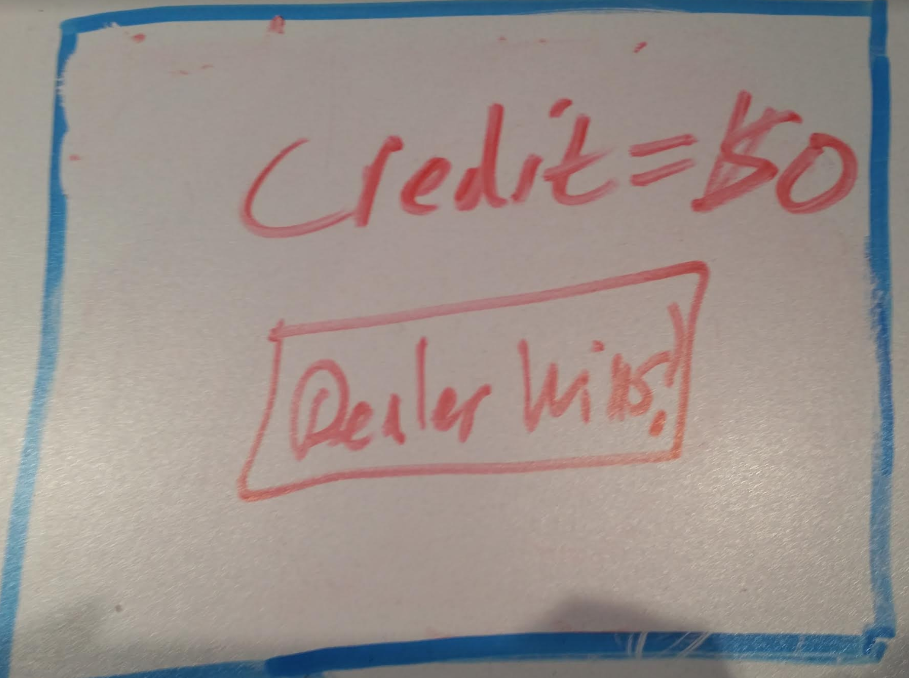
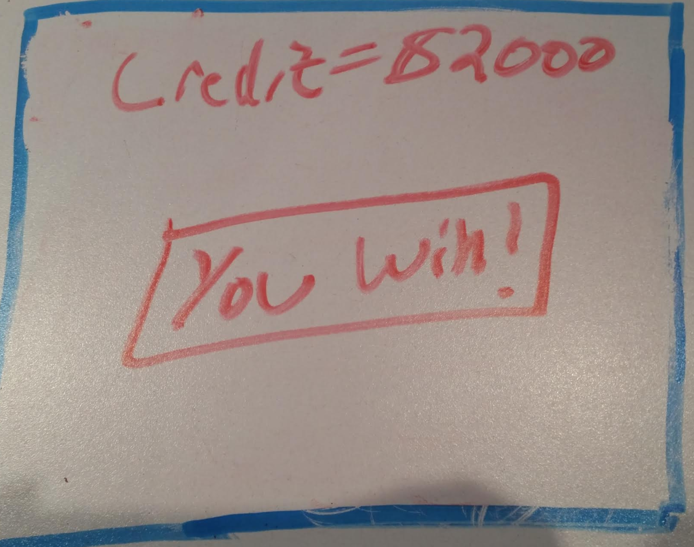

#Blackjack

####1. Wireframes

####2. User Stories
[Link to Trello] (https://trello.com/b/qs9xkSSb/wdi-sm-43-project-1)

####3. Description of MVP (User stories that must be finished to meet the minimum project requirements)

	1. As a user, I want to be able to place a bet, to simulate the real card game.
	2. As a user, I want to be dealt cards, so I can determine my next move.
	3. As a user, I want to be able to see my card total as well as the dealer's, so I can easily calculate my odds/next move.
	4. As a user, I want the option to hit or stay
	5. As a user, I want to know how much money I've won/lost each round so I know my current credit in 	order to bet strategically.
	6. As a user, I want to know when I win or lose the game, so I know the game has ended.

####4. Stretch goals (Things you would like to accomplish after you complete MVP)
	1. As a user, I want to be able to see the rules before I play, to make sure I understand how the game works.
	2. As a user, I want to know how much money/credit I'm starting with, so I can bet strategically.
	3. As a user, I want to be alerted when I win a round
	4. As a user, I want to see the current balance of my money/credit, so I know how much I have left to bet each round.
	5. As a user, I want my credit to be displayed as chips, to make it feel more real.
	6. As a user, when I select my bet amount, I want the chips to go to the center so I can have a visual of my bet.

####5. Technologies you will use
	-HTML
	-CSS
	-Javascript
	-JQuery
	-GitHub

####6. Approach Taken
	-I started with the game logic and pseudo-coded

####7. Installation instructions
	-Clone the Repo.
	-Click on GitPages link to open the game in your browser.

####8. Unsolved Problems
	-Create modals instead of alerts so you can see the cards before the round winner is announced.
	-At will betting system
